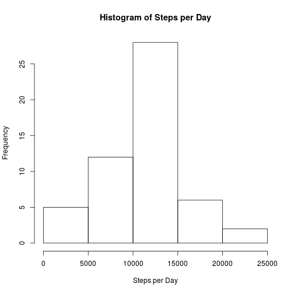
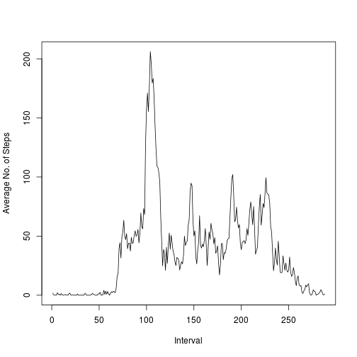
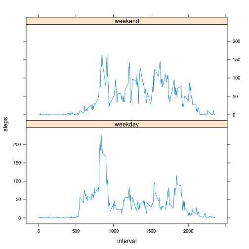

## Loading and preprocessing the data


```r
data_file <- "activity.zip"
activity <- read.csv(unz(data_file, "activity.csv"), colClasses = c("date" = "Date"))
```

```
## Warning in open.connection(file, "rt"): cannot open zip file 'activity.zip'
```

```
## Error in open.connection(file, "rt"): cannot open the connection
```


## What is mean total number of steps taken per day?


```r
steps_per_day <- aggregate(steps ~ date, data = activity, FUN = sum, na.rm = TRUE)
```

```
## Warning: closing unused connection 5 (activity.zip:activity.csv)
```

```r
hist(steps_per_day$steps, main ="Histogram of Steps per Day", xlab = "Steps per Day")
```

 

```r
mn <- as.character(round(mean(steps_per_day$steps),2))
mdn <- as.character(round(median(steps_per_day$steps),2))
```

The mean number of steps per day is 10766.19 and the median is 10765.

## What is the average daily activity pattern?


```r
avg_per_interval <- aggregate(steps ~ interval, data = activity, FUN = mean, na.rm = TRUE)
plot(avg_per_interval$steps, type="l", xlab="Interval", ylab="Average No. of Steps")
```

 

```r
max <- as.character(which.max(avg_per_interval$steps))
hour = as.character(round(as.integer(max)/12,2))
```

The interval that contains the highest number of steps on average is 104 which is around 8.67 hours into the day.

## Imputing missing values


```r
na_row_count = as.character(nrow(activity[which(is.na(activity$steps)),]))

# Take a copy of activity data frame
filled_activity = activity

# Fill in NA values of data frame with averages for that interval.
for(i in 1:nrow(filled_activity)){
    if(is.na(filled_activity[i,1])){
        interval = filled_activity[i, 3]
        average_for_interval = avg_per_interval$steps[match(interval, avg_per_interval$interval)]
        filled_activity[i,1] <- average_for_interval
    } 
}

# Recalculate Steps Per Day
steps_per_day <- aggregate(steps ~ date, data = activity, FUN = sum, na.rm = TRUE)
hist(steps_per_day$steps, main ="Histogram of Steps per Day", xlab = "Steps per Day")
```

 

```r
mn2 <- as.character(round(mean(steps_per_day$steps),2))
mdn2 <- as.character(round(median(steps_per_day$steps),2))
```

The number of rows with NAs was 2304. These have been replaced with the average for the missing time interval.

The mean number of steps per day is 10766.19 and the median is 10765. Compared with mean of 10766.19 and median of 10765 from the original data set.


## Are there differences in activity patterns between weekdays and weekends?


```r
# Create new 'week' vector
weekend = c()
for(i in 1:nrow(filled_activity)){
    if(weekdays(filled_activity[i,2]) %in% c("Saturday", "Sunday")){
        weekend[i] <- "weekend"
    } else{
        weekend[i] <- "weekday"
    }
}
# Add 'week' vector to activity data frame as a factor
filled_activity$week <- as.factor(weekend)
avg_per_interval_week = aggregate(steps ~ interval + week, data = filled_activity, FUN = mean)

# Create Panel Plot with Lattice
library(lattice)
xyplot(steps ~ interval | week, data = avg_per_interval_week, type = "l",  layout = c(1,2))
```

 
